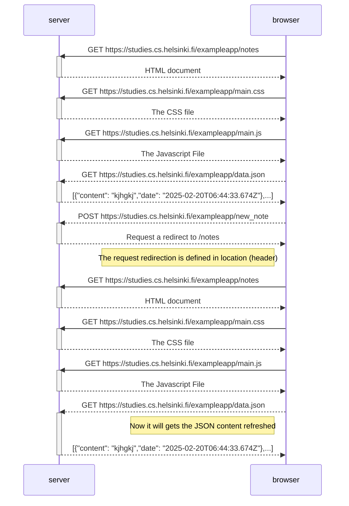

```mermaid
sequenceDiagram
participant server
participant browser
browser->>server: GET https://studies.cs.helsinki.fi/exampleapp/notes
    activate server
    server-->>browser: HTML document
    deactivate server
browser->>server: GET https://studies.cs.helsinki.fi/exampleapp/main.css
activate server
server-->>browser: The CSS file
deactivate server
browser->>server: GET https://studies.cs.helsinki.fi/exampleapp/main.js
activate server
server-->>browser: The Javascript File
deactivate server
browser-->>server: GET https://studies.cs.helsinki.fi/exampleapp/data.json
activate server
server-->>browser: [{"content": "kjhgkj","date": "2025-02-20T06:44:33.674Z"},...]
deactivate server
browser-->>server: POST https://studies.cs.helsinki.fi/exampleapp/new_note
activate server
server-->>browser: Request a redirect to /notes
deactivate server
Note left of browser: The request redirection is defined in location (header)
browser->>server: GET https://studies.cs.helsinki.fi/exampleapp/notes
activate server
server-->>browser: HTML document
deactivate server
browser->>server: GET https://studies.cs.helsinki.fi/exampleapp/main.css
activate server
server-->>browser: The CSS file
deactivate server
browser->>server: GET https://studies.cs.helsinki.fi/exampleapp/main.js
activate server
server-->>browser: The Javascript File
deactivate server
browser-->>server: GET https://studies.cs.helsinki.fi/exampleapp/data.json
activate server
note left of browser: Now it will gets the JSON content refreshed
server-->>browser: [{"content": "kjhgkj","date": "2025-02-20T06:44:33.674Z"},...]
deactivate server
```
