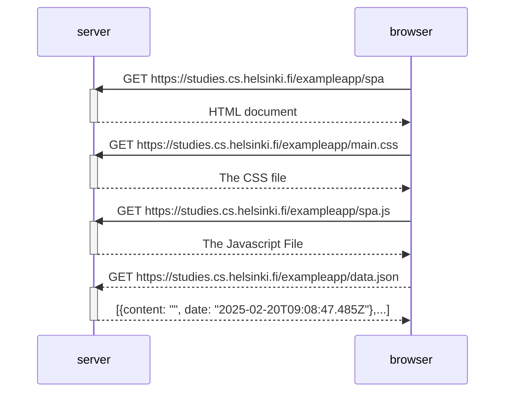

```mermaid
sequenceDiagram
participant server
participant browser
browser->>server: GET https://studies.cs.helsinki.fi/exampleapp/spa
    activate server
    server-->>browser: HTML document
    deactivate server
browser->>server: GET https://studies.cs.helsinki.fi/exampleapp/main.css
activate server
server-->>browser: The CSS file
deactivate server
browser->>server: GET https://studies.cs.helsinki.fi/exampleapp/spa.js
activate server
server-->>browser: The Javascript File
deactivate server
browser-->>server: GET https://studies.cs.helsinki.fi/exampleapp/data.json
activate server
server-->>browser: [{content: "", date: "2025-02-20T09:08:47.485Z"},...]
deactivate server
```
