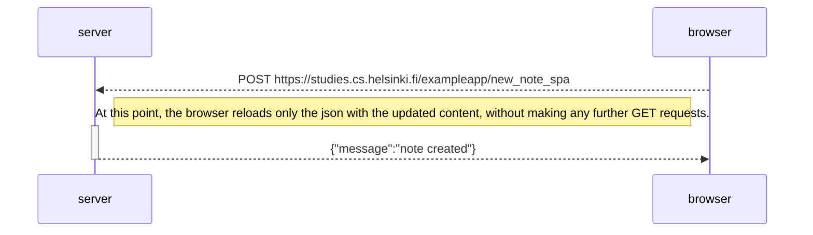

```mermaid
sequenceDiagram
participant server
participant browser
browser-->>server: POST https://studies.cs.helsinki.fi/exampleapp/new_note_spa
note left of browser: At this point, the browser reloads only the json with the updated content, without making any further GET requests.
activate server
server-->>browser: {"message":"note created"}
deactivate server
```
